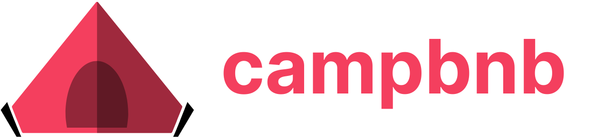

<a name="readme-top"></a>

<!-- PROJECT LOGO -->
<br />
<div align="center">
    <a href="https://campbnb.vercel.app">
        
    </a>
    <h2 align="center">
        <div>Find the perfect place to camp at an amazing price.</div>
        <div>Go outdoors with Campbnb!</div>
    </h2>
    <p align="center">
        Campbnb is an online marketplace and hospitality service that allows people to reserve campsites and outdoor experiences. Campbnb aims to provide a wide range of unique camping experiences and outdoor activites, allowing individuals to explore and connect with nature in various locations. 
    </p>
    <a href="https://campbnb.vercel.app">View Demo</a>
    |
    <a href="https://github.com/francisngo/campbnb/issues">Report Bug</a>
    |
    <a href="https://github.com/francisngo/campbnb/issues">Request Feature</a>
</div>

<!-- TABLE OF CONTENTS -->
<details>
  <summary>Table of Contents</summary>
  <ol>
    <li>
      <a href="#about-the-project">About The Project</a>
      <ul>
        <li><a href="#features">Features</a></li>
        <li><a href="#built-with">Built With</a></li>
      </ul>
    </li>
    <li>
      <a href="#getting-started">Getting Started</a>
      <ul>
        <li><a href="#prerequisites">Prerequisites</a></li>
        <li><a href="#installation">Installation</a></li>
      </ul>
    </li>
    <li><a href="#license">License</a></li>
    <li><a href="#contact">Contact</a></li>
  </ol>
</details>

<!-- ABOUT THE PROJECT -->
## About The Project


The Campbnb application is a replica of the popular online marketplace for short- and long-term homestays and experiences, Airbnb. This project was created as a personal project to showcase my skills in software engineering and gain hands-on experience with various modern web technologies. 

## Features: 
* User Authentication: Leveraging Next-Auth, users can sign up, log in, and log out of the application with email or built-in providers such as Google and Facebook. Passwords are securely hashed and stored using Bcrypt. 
* Listings: Users can view available listings, including details like campsite description, location and pricing. 
* Campsite Management: Hosts can create and manage campsite listings, reservations, adding essential information, images and pricing details. 
* Booking System: Users can select available dates, book properties, and select location categories.
* Search and Filters: Users can search for campsites based on location, dates, and other filters. 
* User Profiles: Each user has a profile page displaying their bookings, listings, and favorites. 

<p align="right">(<a href="#readme-top">back to top</a>)</p>

## Built With

* Next.js
* React.js
* Tailwind CSS
* Prisma
* MongoDB
* NextAuth

<p align="right">(<a href="#readme-top">back to top</a>)</p>

<!-- GETTING STARTED -->
## Getting Started

Here are instructions on how to clone the project into your local directory:

### Installation
1. Clone the repository

```sh
git clone https://github.com/francisngo/campbnb.git
```

2. Change into the directory 
```sh
cd campbnb
```

3. Install NPM packages
```sh
npm install
```

4. Create .env file (see prerequisites below)

5. Run application locally
```sh
npm run dev
```

### Prerequisites
Create a .env file
Set up a Mongo database at https://www.mongodb.com/atlas/database
Set up Facebook Client ID and Client Secret at https://developers.facebook.com/apps/ (be sure to select "Test App")
Set up Google Client ID and Client Secret at https://console.cloud.google.com/
Set up Cloudinary API key at  https://cloudinary.com/

Your .env should look something like this:
```
DATABASE_URL=""
NEXTAUTH_SECRET="NEXTAUTH_SECRET"

FACEBOOK_CLIENT_ID=""
FACEBOOK_CLIENT_SECRET=""

GOOGLE_CLIENT_ID=""
GOOGLE_CLIENT_SECRET=""

NEXT_PUBLIC_CLOUDINARY_CLOUD_NAME=""
```


<!-- LICENSE -->
## License

Distributed under the MIT License. See `LICENSE.txt` for more information.

<p align="right">(<a href="#readme-top">back to top</a>)</p>


<!-- CONTACT -->
## Contact

Francis Ngo - [LinkedIn](https://linkedin.com/in/francisngo) - francis.t.ngo@gmail.com

Project Link: [https://github.com/francisngo/campbnb](https://github.com/francisngo/campbnb)

<p align="right">(<a href="#readme-top">back to top</a>)</p>
